```{r}
#| label: setup
#| include: false

required_packages <- c("resemble")

missing <- required_packages[!sapply(required_packages, requireNamespace, quietly = TRUE)]
if (length(missing) > 0) install.packages(missing)

library(resemble)

knitr::opts_chunk$set(
  echo = TRUE,
  eval = FALSE,
  message = FALSE,
  warning = FALSE, 
  fig.align = 'center'
)
```


## Localised modelling: why? {background-color="#000000"}

::: {.incremental}

- Global linear models assume a single spectrum–response relationship: heterogeneous libraries may violate this.

- Local modelling (_a.k.a_ memory-based learning) restricts fitting to spectrally similar samples, reducing the impact of domain shift [@shenk1997investigation; @naes1990locally]

:::

:::{.notes}

- I WANTED TO MAKE A PRESENTATION TO IMPRESS (AS THE OTHER PRESNTERS MAY HAVE ALSO WANTED)

- BUT THE IDEAS BEHIND THIS ARE SO SIMPLE THAT MAKING AN IMPRESSIVE SET OF SLIDES IS NOT EASY... THEREFORE I TRIED MY BEST TO FOCUS ON ELEGANCE (NO AESTETHIC [HOW SHOULD I PUT IT? HELP ME AS ELEGANCE MAY BE UNDERSTOOD AS AESTETHIC ELEGANCE]) AND CLARITY, AND I HOPE YOU WILL ENJOY IT.

- soil is BOORING, too challenging

- SAMPLING for selecting the anchors!

- models that make sense

- filter out models!

- low uncertainty but may be due to the fact that all experts are worng

- ambiguity in the experts

:::  

## {background-color="#000000"}

> *All models are wrong, but some are useful* -- [@box1976science]

## Localised modelling 

<div style="display:flex; align-items:center; justify-content:center; height:100%;">
  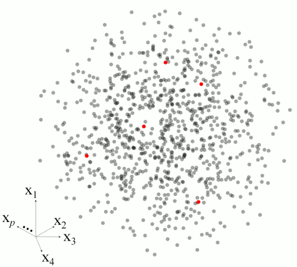
</div>  

## Localised modelling: Trade-offs... {background-color="#000000"}

::: {.incremental}

- Per-query refitting → computational cost at prediction time  

- Full-library access required at prediction → data-sharing constraints  

- No general-purpose interpretation across query-specific models  

- Sensitivity to neighbour selection and spectral inconsistencies  

:::

# Why refit when you can retrieve? {background-color="#000000"}
_Our proposal ..._


## 

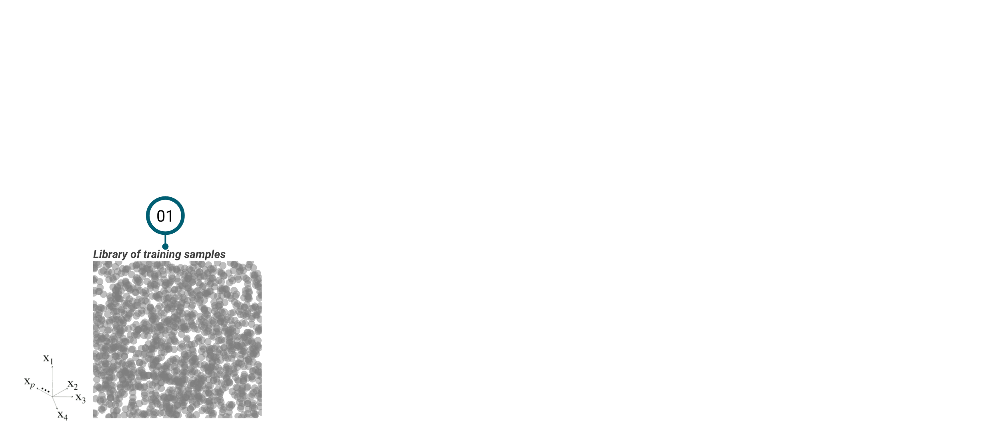 

::: {.small-text}
$$\mathcal{D}_r := \{(\mathbf{x}_r^j, y_r^j)\}_{j=1}^n$$
::: 

## 

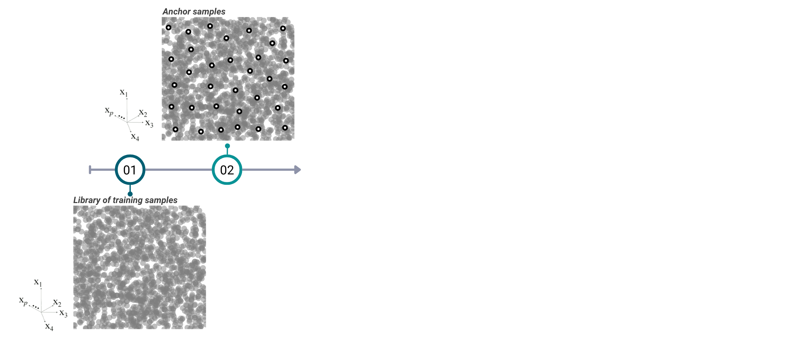

::: {.small-text}
$$\mathcal{A} \subseteq \{1, \dots, n\}$$
::: 

## 

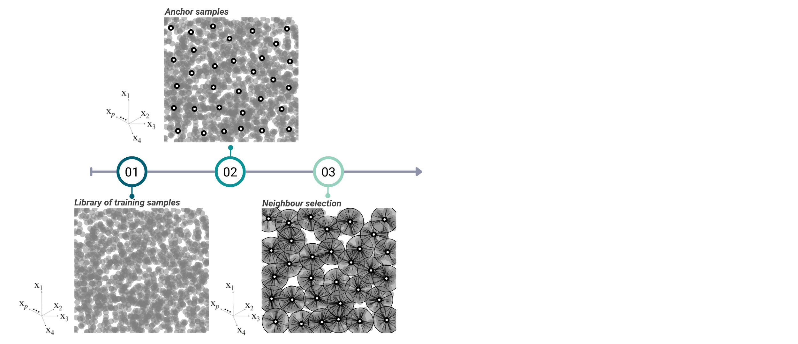

::: {.small-text}
$$\mathcal{N}_k(a) = \{a\} \cup \mathrm{NN}_{k-1}(a), \quad |\mathcal{N}_k(a)| = k$$
::: 


## 

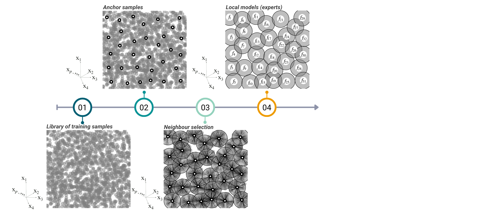

::: {.small-text}
$$f_a: \mathbb{R}^d \to \mathbb{R}, \quad \mathbf{c}_a = \frac{1}{k}\sum_{j \in \mathcal{N}_k(a)} \mathbf{x}_r^j$$
:::


## 

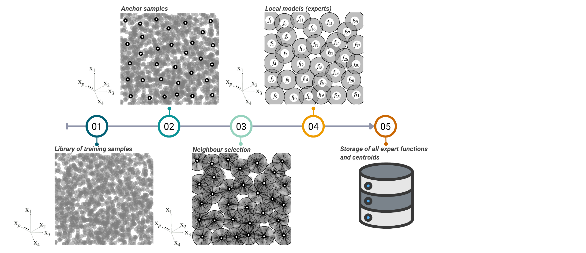

::: {.small-text}
$$\mathcal{L} := \{(f_a, \mathbf{c}_a)\}_{a \in \mathcal{A}}$$
::: 

## 

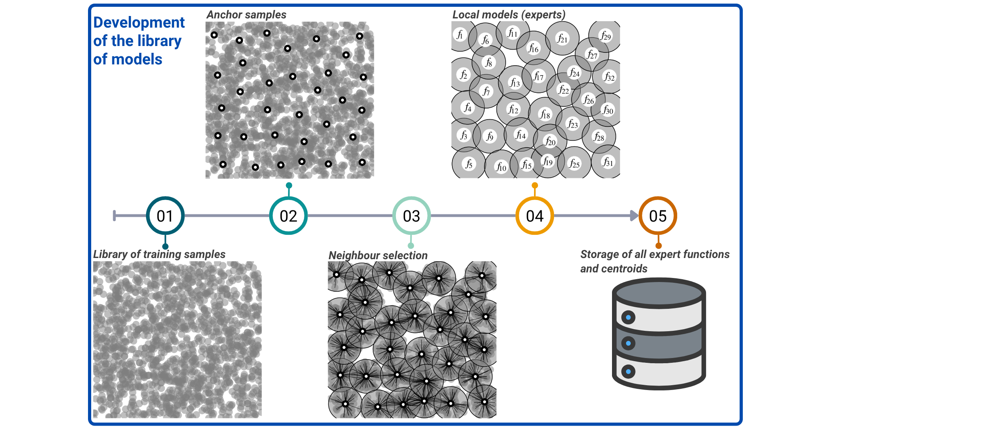


## 

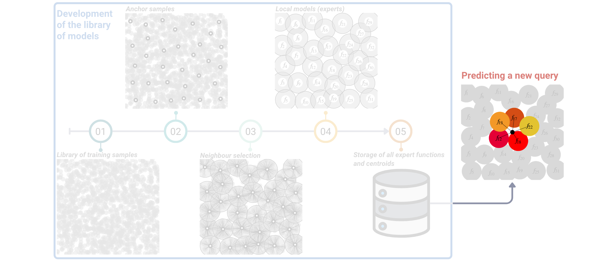

::: {.small-text}
$\hat{y}(\mathbf{x}) = \sum_{a \in \mathcal{H}(\mathbf{x})} w_a(\mathbf{x})\, f_a(\mathbf{x}) \text{;  } \rightarrow \mathcal{H}(\mathbf{x}) \text{: the }h \text{ nearest experts by centroid dissimilarity}$
:::

## `liblex`

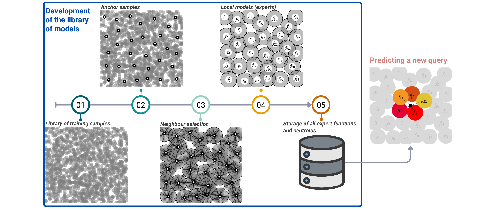


<p style="text-align:center;">Library of local experts</p>


## Operationalisation {background-color="#000000"}

::: {.incremental}

- No per-query model refitting

- Deployment without access to the full reference library, preserving privacy

- Interpretable local models

- Intrinsic per-sample uncertainty proxy

- Anchor spectra or samples with missing $y$ values

- Incrementally extensible

- Competitive predictive accuracy

- Robust under severe domain shift?

::: 

## Background

@ramirez2026spectral

<div class="pdf-embed">
  <iframe
    src="fig/liblex-paper.pdf#toolbar=0&navpanes=0"
    width="100%"
    height="900"
    style="border: none;">
  </iframe>
</div>


## An experiment [1/2]...

A __soil__ IR spectral library from the North America [@hengl2021ossl]  

Open source


## An experiment [2/2]...

A __soil__ IR  spectral dataset from our target domain [@summerauer2021central]

__Target__ $y$: Total carbon


## Variable importance results [1/2]


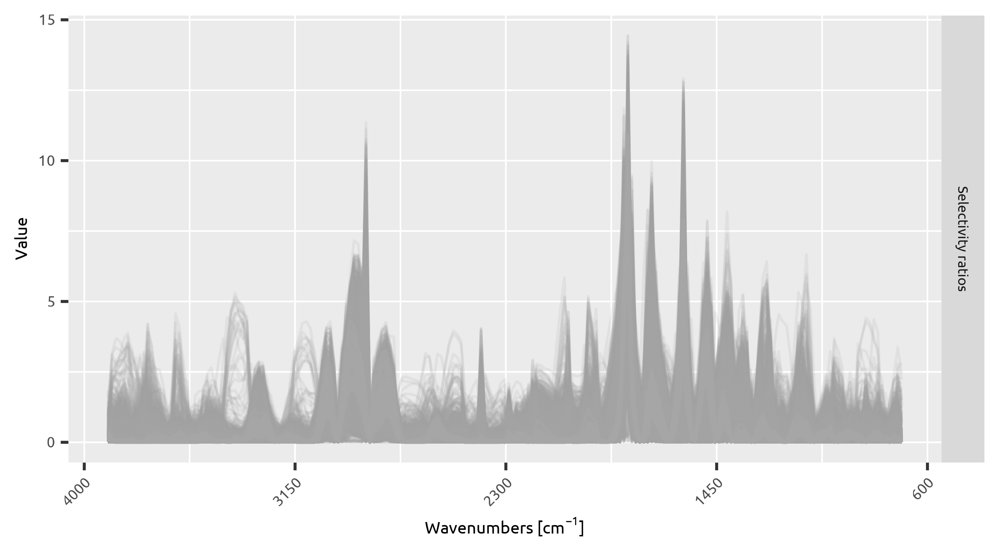


## Variable importance results [2/2]


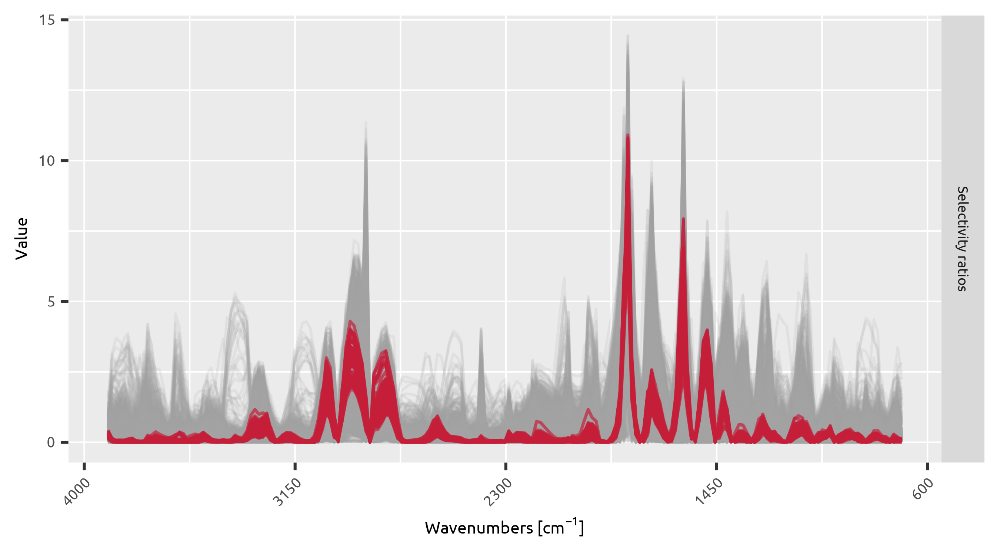


## Which anchors gave birth to our relevant experts?

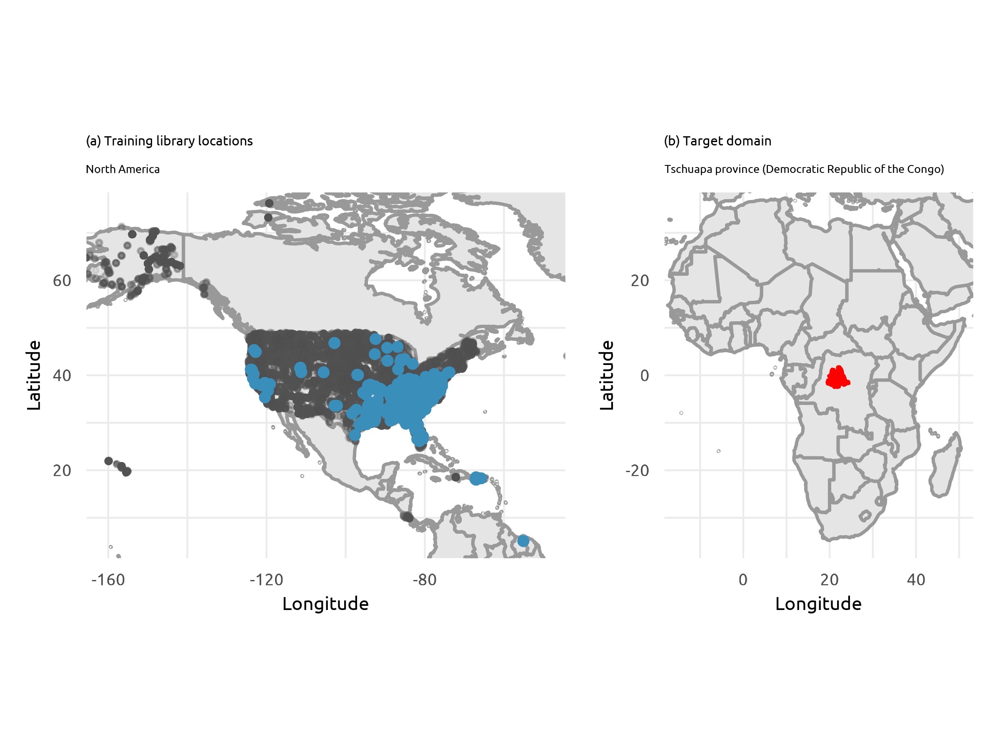

## Validation with independent samples...


## Open-source implementation...{background-color="#000000"}

[since 2013]


[https://cran.r-project.org/package=resemble](https://cran.r-project.org/package=resemble)
```{r}
#| eval: false
liblex()
```

## Open-source implementation... {background-color="#000000"}

[since 2013]


[https://cran.r-project.org/package=resemble](https://cran.r-project.org/package=resemble)

and matlab?

## Future work {background-color="#000000"}

::: {.incremental}

- Learned gating (stacking / meta-learner) as an alternative to distance-based weights

- Alternative dissimilarities (metric learning, embeddings) 

- Incremental update policies and expert pruning  

- Non-linear or hybrid expert architectures

::: 

## Our contributions {background-color="#000000"}

::: {.incremental}

- Reformulate MBL: retrieval and aggregation of pre-computed local experts, replacing per-query refitting  

- Retrieval-gated ensembling via centroid dissimilarity, decoupling neighbourhood definition from model centring  

- Intrinsic per-sample uncertainty proxy from expert dispersion

- Deployment without full-library access, supporting privacy-preserving collaboration

::: 

# <span style="font-size: 1.8em; display: flex; justify-content: center;">Peace</span> {background-color="#000000"}

This presentation: 

```{r}
#| echo: false
#| eval: true
#| fig-align: center
#| fig-width: 3
#| fig-height: 3
library(qrcode)
plot(qr_code("https://l-ramirez-lopez.github.io/idrc-2026-presentation/"))
```


## References


